  

  

## 📌 About Me
- Hi, I'm Priyam Sarkar
- I'm a student and aspiring software developer who enjoys building real-world applications and exploring modern technologies. I'm passionate about backend development, DevOps, artificial intelligence, and open-source software.
- I believe in learning by building. Whether I'm developing new projects, solving programming challenges, or experimenting with new tools and frameworks, I'm always looking for ways to improve my skills and deepen my understanding of software engineering.
- 🚀 Interests
* Full-Stack Development
* Backend Engineering
* Artificial Intelligence & Machine Learning
* DevOps & Cloud Technologies
* Linux & Open Source
- 🌱 Currently
* Building projects and expanding my portfolio
* Learning new technologies every day
* Solving algorithmic and system design problems
* Contributing to open-source software

## 🧠 My Focus Areas
- LLMs
- Agentic AI
- Backend

## 📊 GitHub Stats & Trophies

  
  

  

  

  

## 🛠️ Languages & Tools

<h3 align="center">Programming Languages</h3>

  &nbsp;&nbsp;
  &nbsp;&nbsp;
  &nbsp;&nbsp;
  &nbsp;&nbsp;
  &nbsp;&nbsp;
  

<h3 align="center">Frontend</h3>

  &nbsp;&nbsp;
  &nbsp;&nbsp;
  &nbsp;&nbsp;
  

<h3 align="center">Backend</h3>

  &nbsp;&nbsp;
  &nbsp;&nbsp;
  

<h3 align="center">Database</h3>

  &nbsp;&nbsp;
  &nbsp;&nbsp;
  

<h3 align="center">Tools</h3>

  &nbsp;&nbsp;
  

  

 

## 🔗 Connect with Me

  &nbsp;&nbsp;
  &nbsp;&nbsp;
  

  

  

